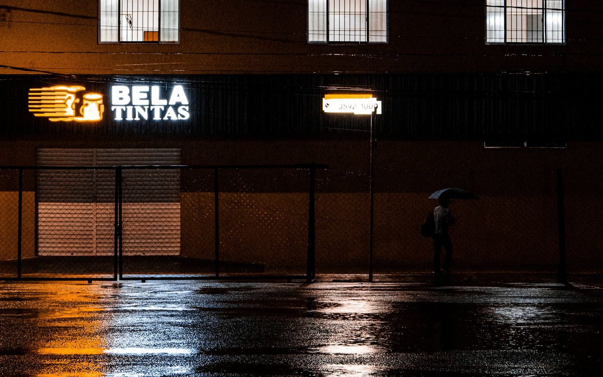

<h1 align="center">Hytic</h1>

<h3 align="center">A local-first RAW photo editor and color-grading workspace for photographers and filmmakers.</h3>

Hytic is an open-source photo editor for developing camera RAW files, shaping film-inspired color, and exporting finished images or reusable looks. It runs in a modern browser or as a Windows desktop app, and processes imported image pixels on your device instead of uploading them to a rendering server. It is a local, no-subscription alternative for focused color work alongside larger catalog or cloud-editing suites.

## Download

| Platform | Availability | Notes |
| --- | --- | --- |
| Browser app | Build and run locally (instructions below) | No installation. A modern browser with WebGL and local storage support is recommended. |
| Windows 10/11 | Build from source (below) | A signed installer is not currently published. |
| macOS / Linux | Web version | Native desktop packaging is not currently configured for these platforms. |

There are no Homebrew, winget, or apt packages at this time.

## Screenshots

<p align="center">
  
</p>

## Why Hytic

- **Keep photo pixels on your device.** Import, decode, edit, and export locally without sending images to a remote rendering service.
- **Start quickly.** Open the browser editor without creating an account or installing a desktop application.
- **Build a look, not just a preset.** Combine precise color controls with adjustable film-inspired effects and local edits.
- **Carry compatible color elsewhere.** Export 3D LUTs and Lightroom-compatible XMP looks for supported workflows.
- **Keep your originals.** Hytic works on copies in its local project workspace and does not overwrite the source file.

## Features

- **RAW development** — Open many common camera RAW families, including DNG, CR3, ARW, NEF, RAF, ORF, PEF, and RW2; support varies by camera and file variant.
- **Color grading** — Adjust exposure, white balance, curves, contrast, saturation, color balance, density, tone, and more.
- **Film-inspired rendering** — Add grain, halation, bloom, diffusion, scattering, and refraction.
- **Local adjustments and retouching** — Work with layers, masks, brush-based adjustments, and spot retouch tools.
- **Reference matching and scopes** — Compare a reference image and inspect waveform, histogram, and other image scopes.
- **Presets and look interchange** — Use built-in looks and export supported 3D LUT and XMP formats.
- **Image export** — Export JPEG, WebP, PNG (8-bit or 16-bit), or baseline TIFF, with available resize and metadata options.
- **Project library** — Organize imported media and edit versions in the app's local workspace.
- **Video workflows** — Import supported video containers for trimming and graded MP4/WebM export when the browser supports the required codecs.

## How files and data are handled

Hytic leaves the source files where they are and saves imported media, project metadata, previews, and edit state in browser-managed local storage (OPFS where available, with IndexedDB or in-memory fallback paths). The Windows desktop app uses its local application storage. Exported images and look files are saved separately through the browser or operating system download flow.

Hytic does not write edits back into the original image. If you move, rename, or edit a source file outside Hytic, the copy already imported into a project does not automatically follow or refresh. Keep independent backups: clearing browser site data or removing the app's local data can delete project copies, but does not delete the original files in their source folders. See [PRIVACY.md](PRIVACY.md).

## Uninstall and remove local data

Uninstalling Hytic or clearing its local app data removes project copies stored by that installation. It does not delete source photos or exported files saved elsewhere.

- **Browser:** In your browser's settings, clear the app's site data and storage. This removes Hytic's local projects and settings for that browser profile.
- **Windows desktop:** Uninstall Hytic from **Settings → Apps → Installed apps**. To remove its projects too, clear Hytic's local application data. Back up anything you want to keep before clearing app data.
- **macOS / Linux:** There is no native desktop package currently; clear the browser app's site data in that browser.

## Build from source

### Prerequisites

- Node.js 22 and [pnpm](https://pnpm.io/) 10.12.1 (matching the CI build).
- For Windows desktop packaging: [Rust](https://www.rust-lang.org/tools/install), Microsoft C++ Build Tools, and WebView2 Runtime.
- For the browser build: a supported browser with WebGL.

```sh
# From the project checkout
cd src
pnpm install

# Run the browser editor at the local development URL.
pnpm --dir frontend dev

# Build the static browser app.
pnpm --dir frontend build
# Host src/frontend/.output/public on your chosen static host.

# Windows desktop build (from src; requires Rust, C++ Build Tools, and WebView2).
# Install Rust and the Microsoft C++ Build Tools before running this on Windows.
pnpm --dir frontend tauri:build
# The NSIS installer is written under src/frontend/src-tauri/target/release/bundle.
```

## Supported formats

Support labels describe implemented paths; partial formats cover only documented subsets, and camera/browser compatibility can vary.

| Format | Import | Export | Notes |
| --- | --- | --- | --- |
| Camera RAW (DNG, CR2/CR3, ARW, NEF/NRW, RAF, ORF, PEF, RW2, and others) | Yes | — | Broad extension support; test files from your camera, especially uncommon compression variants. |
| JPEG | Yes | Yes | JPEG export supports quality settings. |
| PNG | Yes | Yes | 8-bit and 16-bit export options. |
| WebP | Yes | Yes | Import and export. |
| AVIF, GIF, BMP | Yes | — | GIF preview uses its first frame. |
| HEIC / HEIF | Yes | — | Decoded through a WebAssembly codec. |
| TIFF | Partial | Yes | Import supports a subset of strip-based files; TIFF export is baseline uncompressed RGBA8. |
| DPX, EXR | Partial | — | Validated uncompressed/limited-compression subsets; high-bit-depth input is reduced for preview. |
| Video (MP4, WebM, MOV, AVI, MKV, M4V) | Partial | Partial | Browser-supported codecs only; video trim and graded MP4/WebM export require compatible browser codecs. |
| `.cube`, `.clf` | Partial | Partial | Color LUT interchange. CLF covers a simple LUT3D subset; imported LUT data is not currently applied as an edit stage. |

For detailed decoder limitations, see [the codec matrix](src/frontend/docs/image-io-codec-matrix.md) and [LUT interchange notes](src/frontend/docs/interchange.md).

## Architecture

Hytic keeps its editor UI and interactive renderer in the frontend. The Tauri 2
host contains native filesystem and dialog integrations plus a Rust GPU engine;
the browser build uses the existing Three.js/WebGL2 engine and browser storage.
The native command surface is in place, while routing editor project and
import/export workflows through it remains an integration step.

| Area | Responsibility | Current location |
| --- | --- | --- |
| Frontend | SolidJS UI, Vite/SolidStart build, Three.js/WebGL2 renderer, existing image engine, browser workers | `src/frontend/` |
| Tauri host | Native application lifecycle, dialog/filesystem plugins, and registered Rust commands | `src/frontend/src-tauri/` |
| Native render engine | Rust/wgpu image processing and export commands exposed by the Tauri host | `src/frontend/src-tauri/crates/hytic_engine/` |
| Shared assets | UI, codec, preset, and other static assets consumed by frontend builds | `src/frontend/public/assets/` |
| Browser persistence | OPFS-first project repository with IndexedDB compatibility/fallback | `src/frontend/src/project/` |
| Browser app output | Static app routes; `/` opens the editor, with localized routes available | `src/frontend/.output/public/` |

The architecture and runtime boundaries are documented in
[`src/frontend/docs/system-architecture.md`](src/frontend/docs/system-architecture.md).

### Key libraries

| Library | Purpose |
| --- | --- |
| [SolidJS](https://www.solidjs.com/) | Reactive UI and application components. |
| [Tauri](https://tauri.app/) | Windows desktop application shell and native integrations. |
| [Three.js](https://threejs.org/) | GPU-backed image rendering and shader pipeline. |
| [Vite](https://vite.dev/) | Frontend development and production builds. |
| [libraw-wasm](https://www.npmjs.com/package/libraw-wasm) | WebAssembly RAW decoding. |
| [libheif-js](https://www.npmjs.com/package/libheif-js) | HEIC/HEIF decoding in the browser. |
| [ExifReader](https://www.npmjs.com/package/exifreader) | Reading supported camera and capture metadata. |
| [mediabunny](https://www.npmjs.com/package/mediabunny) | Browser media and video workflows. |

## License

Hytic is released under the [MIT License](LICENSE).

## Privacy

Imported image pixels are decoded and processed locally. The app may request its code, fonts, and assets; those requests are separate from photo pixels and project data. Read the full [privacy policy](PRIVACY.md).
